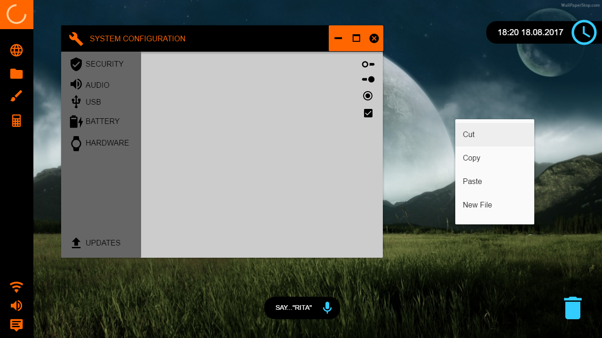

# Nanoos
Microkernel, for Smartphone usage, modular like a linux kernel, but written entirely in rust.

## Goals:

- MODULAR
- WHERE BUILDING AN OFFLINE OPERATING SYSTEM
  - IT IS MOE LIKE A CLIENT SERVER MODELL, INSTEAD OR IN MIND!
  - AND A LINUX KERNEL IN MIND, BUT NOT MONOLOTHIC!
- SOFTWARE-ISOLATED PROCESSES
- TFS FILESYSTEM SUPPORT
- NEWEST 64 BIT SOC'S
- OPEN SOURCE RUST POWERED SOFTWARE, TOOLS AND DRIVERS
- DRIVERS & FIRMWARE ARE WRITTEN IN RUST AND CAN BE MODIFIED IN LONG TERM
  - DRIVER SHOULD BE CODED, ALSO LIKE A MODULAR ARCHITECT, WITH NO HIDDEN SOURCE CODE; IN MIND!
- NO PROPRIETORY STUFF, NO BLOBBS
- SECURITY ACCESS MANAGER
  - MAIN CONTROL ACCESS "TOOL" TO GET IN THE SYSTEM!
- ROOT ACCESS (FROM START)

## SUPPORTED SOC'S
- INTEL SOC'S
  - Intel® Atom® x3-C3130 Prozessor to Intel® Atom® x7-Z8700 Prozessor
  - INTEL ATOM Z3580
- QUALCOMM SOC'S
  - SNAPDRAGON 801 to QUALCOMM SNAPDRAGON 830
- ARM SOC'S
  - CORTEX A53 to CORTEX A75
- MEDIATHEK SOC'S
  - X10 to X30
  - P10 to P25

## JOBS:
ATTENTION: THIS IS JUST A PROOF OF CONCEPT AND WORK STUDY, BUT EVERYBODY CAN WORK ON THIS TOO!

- CHIEF KERNEL ARCHITECT
- CHIEF IMPLENTING ARCHITECT
- UI\UX\GUI DESIGNER
- BUGFIXING
- aso. 

^^SHOWCASE, DESIGN CONCEPT^^
